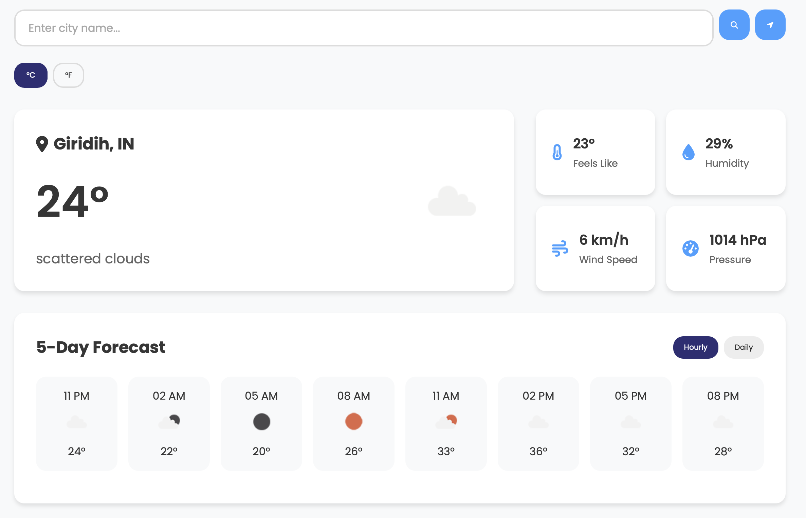

# ClimaSphere 🌦️ - Modern Weather Dashboard

A modern, responsive weather application that delivers real-time weather data and forecasts with a sleek interface.

 <!-- Add your banner image -->

## 🌟 Features

- 🌍 Real-time weather data for any city worldwide
- 📍 Automatic geolocation detection
- 📈 5-day weather forecast with hourly/daily views
- 🌡️ Temperature unit conversion (Celsius/Fahrenheit)
- 🔍 Recent search history with quick access
- 📱 Fully responsive design for all devices
- 🌈 Interactive UI with weather-themed animations
- ⚡ API caching for faster performance

## 📸 Screenshots

| Desktop View | Mobile View |
|--------------|-------------|
|  |  |

## 🛠️ Technologies Used

### **Frontend**  

### **API**  

### **Tools**  

## 🌐 API Reference

- [OpenWeatherMap Current Weather Data API](https://openweathermap.org/current)
- [OpenWeatherMap 5 Day Forecast API](https://openweathermap.org/forecast5)

## 🤝 Contributing

Contributions are welcome! Please see our [CONTRIBUTING Guidelines](CONTRIBUTING.md) for details on how to get started.

## 📜 License

This project is licensed under the MIT License - see the [LICENSE](LICENSE) file for details.

## 🙏 Acknowledgments

- [OpenWeatherMap](https://openweathermap.org/) for their excellent weather API
- [Font Awesome](https://fontawesome.com/) for the beautiful icons
- [Google Fonts](https://fonts.google.com/) for the Poppins typeface
